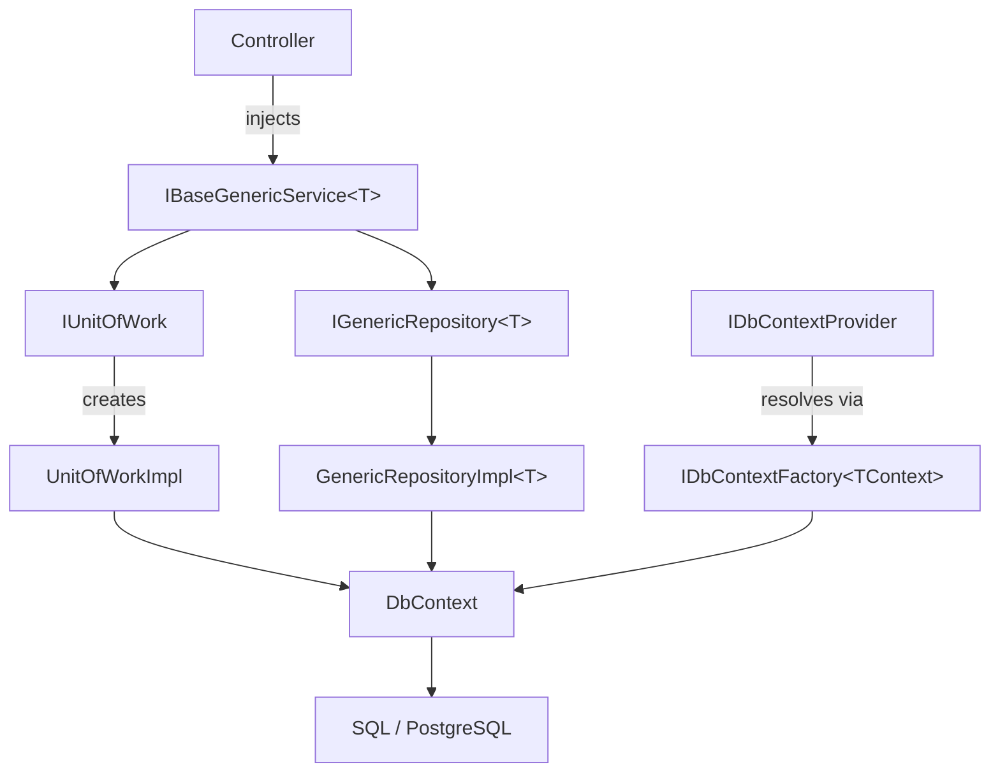

# DynamicDataCore

[](https://github.com/CesarSoftNica175/DynamicDataCore/packages)
[](https://dotnet.microsoft.com)
[](LICENSE)

Lightweight, extensible data access framework for .NET built on EF Core. Provides Unit of Work, generic repositories, four pagination strategies, async streaming, bulk operations, and multi-database support — all with full `CancellationToken` propagation.

---

## What's new in v2.1.0

Fully backward compatible with 2.0 (no existing public signature changed).

- **Stored procedures, safely** — `ISqlProcedureExecutor` (`QueryAsync`, `QuerySingleOrDefaultAsync`, `ExecuteAsync`, `QueryMultipleAsync`). No API accepts SQL text; see [Stored procedures](#stored-procedures-v21).
- **Read-only views** — `IReadRepository<T>` for keyless entities (`HasNoKey().ToView(...)`).
- **Raw-SQL lock** — BannedApiAnalyzers (`BannedSymbols.txt`) plus a reflection test.
- **EF Core 9.x on `net8.0`, EF Core 10.x on `net10.0`.**

## What's new in v2.0.0

- **Critical bug fix** — transactions now actually commit (v1 disposed without calling `CommitAsync`).
- **Multi-database** — `IDbContextProvider` with `IDbContextFactory<TContext>` pooling per logical key.
- **Four pagination strategies** — Offset, Keyset, Seek (last-seen-ID), and Cursor.
- **`IAsyncEnumerable<T>` streaming** — memory-bounded iteration for large result sets.
- **Bulk operations** — producer-consumer pipeline via `System.Threading.Channels`.
- **`CancellationToken`** on every public async API.
- **`IAsyncDisposable`** on `IUnitOfWork`; use `await using`.
- **Multi-target** — `net8.0` and `net10.0`.
- **`record sealed`** for all DTOs; `sealed class` for all implementations.

See [CHANGELOG.md](CHANGELOG.md) for the full list. Upgrading from v1? See [docs/migration-v1-to-v2.md](docs/migration-v1-to-v2.md).

---

## Installation

The package is published to GitHub Packages. Add the source to your `nuget.config`:

```xml
<configuration>
  <packageSources>
    <add key="github" value="https://nuget.pkg.github.com/CesarSoftNica175/index.json" />
  </packageSources>
</configuration>
```

```bash
dotnet add package DynamicDataCore --version 2.1.0
```

---

## Quick start — single database

Register your `DbContext` and add DynamicDataCore:

```csharp
// Program.cs
builder.Services.AddDbContextPool<AppDbContext>(opt =>
    opt.UseSqlServer(builder.Configuration.GetConnectionString("Default")));

builder.Services.AddDynamicCoreInfrastructure();
```

Inject and use `IBaseGenericService<T>`:

```csharp
public class ProductService(IBaseGenericService<Product> svc)
{
    public async Task AddAsync(Product p, CancellationToken ct = default)
    {
        var result = await svc.AddAsync(p, ct);
        if (!result.Success) throw new Exception(result.Message);
    }

    public async Task<IEnumerable<Product>> GetAllAsync(CancellationToken ct = default)
    {
        var result = await svc.RetrieveAsync(cancellationToken: ct);
        return result.Data ?? [];
    }
}
```

Any primary key type is supported — `int`, `Guid`, `string`, etc.:

```csharp
var result = await svc.RetrieveByIdAsync(Guid.Parse("..."), cancellationToken: ct);
```

---

## Multi-database setup

> **Note:** `IDbContextProvider` is only registered when using the `Action<DynamicCoreOptions>` overload below. The parameterless `AddDynamicCoreInfrastructure()` does **not** register it.

Register each `DbContext` independently, then map logical keys:

```csharp
builder.Services.AddDbContextPool<PrimaryDbContext>(opt =>
    opt.UseSqlServer(builder.Configuration["Databases:Primary"]));

builder.Services.AddDbContextPool<ReportingDbContext>(opt =>
    opt.UseNpgsql(builder.Configuration["Databases:Reporting"]));

builder.Services.AddDynamicCoreInfrastructure(opt =>
{
    opt.AddDatabase<PrimaryDbContext>("Primary");
    opt.AddDatabase<ReportingDbContext>("Reporting");
});
```

Resolve a typed context by key:

```csharp
public class ReportService(IDbContextProvider provider)
{
    public async Task RunReportAsync(CancellationToken ct)
    {
        using var ctx = provider.CreateContext<ReportingDbContext>("Reporting");
        var rows = await ctx.Set<SalesRow>().ToListAsync(ct);
        // ...
    }
}
```

---

## Transactions

`IUnitOfWork` implements `IAsyncDisposable` — always use `await using`:

```csharp
public class OrderService(IUnitOfWork uow)
{
    public async Task<OperationResult<bool>> CreateOrderAsync(
        Order order, IEnumerable<OrderItem> items, CancellationToken ct = default)
    {
        try
        {
            await uow.BeginTransactionAsync(ct);

            var orderResult = await uow.Repository<Order>().AddAsync(order, ct);
            if (!orderResult.Success) throw new Exception(orderResult.Message);

            foreach (var item in items)
            {
                var itemResult = await uow.Repository<OrderItem>().AddAsync(item, ct);
                if (!itemResult.Success) throw new Exception(itemResult.Message);
            }

            await uow.CommitTransactionAsync(ct);
            return OperationResult<bool>.Ok(true);
        }
        catch (Exception ex)
        {
            await uow.RollbackTransactionAsync(ct);
            return OperationResult<bool>.Fail("Transaction rolled back.", ex);
        }
    }
}
```

---

## Pagination — choosing a strategy

| Strategy | Use when | Method |
|---|---|---|
| **Offset** | Small tables, random-access by page number | `RetrievePagedByOffsetAsync` |
| **Keyset** | Large append-only tables, sorted navigation | `RetrievePagedByKeysetAsync` |
| **Seek / Last-Seen-ID** | ID-ordered feeds (infinite scroll) | `RetrievePagedBySeekAsync` |
| **Cursor** | Stable opaque cursor exposed in API responses | `RetrievePagedByCursorAsync` |

### Offset pagination

```csharp
var page = await svc.RetrievePagedByOffsetAsync(
    request: new OffsetPageRequest(Page: 2, PerPage: 20),
    orderBy: p => p.CreatedAt,
    cancellationToken: ct);

// page.Items          — current page entities
// page.Metadata       — CurrentPage, PerPage, Total, LastPage
// page.HasNextPage    — true if more pages exist
```

### Keyset pagination (no COUNT query, fast on large tables)

```csharp
// First page — After: null fetches from the beginning
var page = await svc.RetrievePagedByKeysetAsync(
    request: new KeysetPageRequest<int>(After: null, PerPage: 20),
    keySelector: p => p.Id,
    cancellationToken: ct);

// Next page — pass last ID from previous page
var next = await svc.RetrievePagedByKeysetAsync(
    request: new KeysetPageRequest<int>(After: page.Items[^1].Id, PerPage: 20),
    keySelector: p => p.Id,
    cancellationToken: ct);
```

### Seek / Last-Seen-ID

```csharp
var page = await svc.RetrievePagedBySeekAsync(
    request: new SeekPageRequest<int>(LastSeenId: lastId, PerPage: 20),
    keySelector: p => p.Id,
    cancellationToken: ct);
```

### Cursor pagination (stable opaque cursors)

```csharp
// First page
var page = await svc.RetrievePagedByCursorAsync(
    request: new CursorPageRequest(Cursor: null, PerPage: 20),
    keySelector: p => p.Id,
    cancellationToken: ct);

// Subsequent page — use NextCursor from previous response
var next = await svc.RetrievePagedByCursorAsync(
    request: new CursorPageRequest(Cursor: page.NextCursor, PerPage: 20),
    keySelector: p => p.Id,
    cancellationToken: ct);
```

---

## Streaming large result sets

Use `StreamAsync` to iterate millions of rows without loading them all into memory:

```csharp
await foreach (var product in svc.StreamAsync(
    predicate: p => p.IsActive,
    cancellationToken: ct))
{
    await ProcessAsync(product, ct);
}
```

---

## Bulk operations

`BulkInsertAsync`, `BulkUpdateAsync`, and `BulkDeleteAsync` process entities in configurable batches using a `System.Threading.Channels` producer-consumer pipeline. Back-pressure prevents out-of-memory errors on large collections.

```csharp
var result = await svc.BulkInsertAsync(products, batchSize: 500, cancellationToken: ct);
// result.Data — total rows processed
// result.Success — false if any batch throws
```

---

## OperationResult\<T\> pattern

All service and repository methods return `OperationResult<T>` — a `sealed record` that wraps success/failure uniformly:

```csharp
var result = await svc.AddAsync(entity, ct);

if (!result.Success)
{
    logger.LogError("Failed: {Message} | TraceId: {TraceId}", result.Message, result.TraceId);
    return Problem(result.Message);
}
```

Paginated results from the legacy `RetrievePagedAsync` include `result.PaginationMetadata`:

```csharp
var paged = await svc.RetrievePagedAsync(page: 1, perPage: 10);
var meta = paged.PaginationMetadata; // CurrentPage, Total, LastPage, etc.
```

---

## Stored procedures (v2.1)

Registration reads the connection string from `IConfiguration` (`ConnectionStrings:Reporting`, user secrets, env vars...). Nothing is stored in the repo.

```csharp
services.AddDynamicDataCoreProcedures("Reporting");
```

The procedure is a validated `ProcedureName` (`schema.name`, ASCII letters/digits/underscore; anything else throws). Data travels only in typed parameters:

```csharp
var parameters = ProcedureParameters.Create()
    .Structured("@Items", new TableValuedRows(
        [new TableValueColumn("Id", SqlDbType.Int), new TableValueColumn("Label", SqlDbType.NVarChar, 50)],
        items.Select(i => new object?[] { i.Id, i.Label })),
        TableTypeName.Create("ddc.IdList"))                       // or a DataTable
    .Input("@Prefix", SqlDbType.NVarChar, "web", size: 20)
    .Output("@Count", SqlDbType.Int)
    .Output("@Message", SqlDbType.NVarChar, size: 100)
    .ReturnValue();

// Rows affected + RETURN value + output parameters
ProcedureResult r = await executor.ExecuteAsync(ProcedureName.Create("ddc.usp_Demo"), parameters, ct);
int count = r.GetOutput<int>("@Count");   // r.ReturnValue, r.RowsAffected

// Map one result set (types with settable properties, records, or scalars; columns match by name, case-insensitive)
IReadOnlyList<Item> rows = await executor.QueryAsync<Item>(ProcedureName.Create("dbo.usp_Items"), parameters, ct);
Item? one = await executor.QuerySingleOrDefaultAsync<Item>(name, parameters, ct);   // throws if more than one row

// Several result sets, read in order
await using var multi = await executor.QueryMultipleAsync(name, parameters, ct);
var items = await multi.ReadAsync<Item>(ct);
var summary = await multi.ReadSingleOrDefaultAsync<Summary>(ct);
```

Notes: always `CommandType.StoredProcedure`; mapping is built in (no Dapper, nothing third-party exposed); an empty `TableValuedRows` is sent as an empty table; output/return values are only available from `ExecuteAsync`.

### Read-only views

```csharp
// In the consumer's DbContext
protected override void OnModelCreating(ModelBuilder b) => b.ConfigureReadOnlyView<OrderSummary>("v_OrderSummary", "reporting");

services.AddDynamicDataCoreReadRepositories();   // IReadRepository<> (needs IAppDbContext registered)

var page = await repo.PageAsync(new OffsetPageRequest(1, 20), q => q.OrderBy(v => v.Id), v => v.Status == "Open", ct);
```

`IReadRepository<T>` offers `ListAsync`, `FirstOrDefaultAsync`, `CountAsync`, `AnyAsync` and `PageAsync` - always `AsNoTracking`, no write members.

### Raw SQL is locked out

`BannedSymbols.txt` bans `FromSqlRaw`/`FromSqlInterpolated`/`FromSql`, `ExecuteSql*`, `SqlQuery*` and `SqlCommand.CommandText` in the published projects (RS0030 is an error). The only exception is the one documented `#pragma` in `SqlProcedureExecutor`. A reflection test asserts that no public method takes a `string` parameter named `sql`, `commandText` or `query`.

> Microsoft.Data.SqlClient is now a dependency of the `DynamicDataCore` package (driver only; the core still references no EF provider).

---

## Architecture



---

## Package summary

| Layer | Type | Description |
|---|---|---|
| Abstractions | `IAppDbContext` | Minimal EF Core DbContext abstraction |
| Abstractions | `IUnitOfWork` | Transaction coordination + repository access |
| Abstractions | `IGenericRepository<T>` | CRUD, pagination, streaming, bulk |
| Abstractions | `IBaseGenericService<T>` | Application-layer service over repository |
| Abstractions | `IDbContextProvider` | Multi-database context resolution by key |
| Implementation | `UnitOfWorkImpl` | EF Core `IUnitOfWork` (sealed, IAsyncDisposable) |
| Implementation | `GenericRepositoryImpl<T>` | EF Core repository with all pagination strategies |
| Implementation | `BaseGenericServiceImpl<T>` | Delegates to UoW + repository |
| Implementation | `PooledDbContextProvider` | Resolves DbContexts via `IDbContextFactory<TContext>` |
| Abstractions | `ISqlProcedureExecutor` | Stored-procedure execution (v2.1) |
| Abstractions | `ProcedureName`, `ProcedureParameters` | Validated name + typed parameter builder (v2.1) |
| Abstractions | `IReadRepository<T>` | Read-only access to keyless view entities (v2.1) |
| Implementation | `SqlProcedureExecutor` | Microsoft.Data.SqlClient executor (v2.1) |
| Implementation | `ReadRepositoryImpl<T>` | EF Core read-only repository (v2.1) |
| Common | `OperationResult<T>` | Sealed record — unified success/failure envelope |
| Common | `PaginationMetadata` | Sealed record — page metadata |
| Common | `PagedResult<T>` | Sealed record — items + metadata + next cursor |
| Common | `OffsetPageRequest` | Sealed record — page + perPage |
| Common | `KeysetPageRequest<TKey>` | Sealed record — after + perPage + direction |
| Common | `SeekPageRequest<TKey>` | Sealed record — lastSeenId + perPage |
| Common | `CursorPageRequest` | Sealed record — opaque cursor + perPage |

---

## License

MIT — free to use, modify, and distribute under the same terms.

---

## Creator & license

DynamicDataCore is open source (MIT) and was created in Nicaragua by **César Adolfo Solís Alvarez** ([CelestialDevelopment](https://github.com/CesarSoftNica175)).

Copyright (c) 2025-2026 César Adolfo Solís Alvarez (CelestialDevelopment). Released under the [MIT License](LICENSE.txt): you may use it freely, including in commercial projects, as long as the copyright notice is kept.
