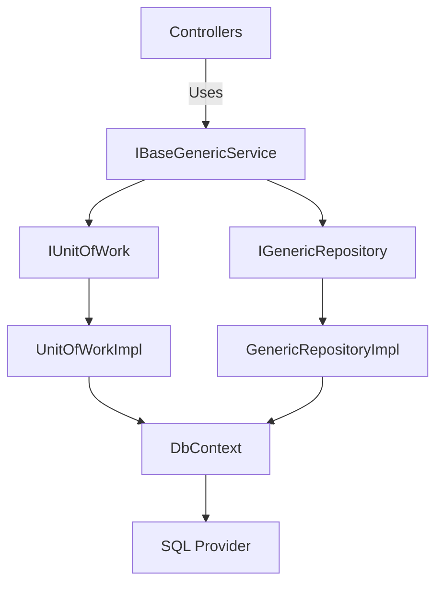

# DynamicDataCore

DynamicDataCore is a lightweight, extensible data access framework designed to simplify repository and unit of work patterns in .NET applications.  
It provides an abstraction layer over Entity Framework Core (EF Core), supporting multiple `DbContext` configurations, explicit transactions, and automatic operation result wrapping for consistent error handling.

---

## 📦 Key Features

- Generic repository and unit of work implementation.
- Full async/await support.
- Built-in transaction management (`BeginTransactionAsync`, `CommitTransactionAsync`, `RollbackTransactionAsync`).
- Multiple `DbContext` support through factory configuration.
- Standardized `OperationResult<T>` responses.
- Clean separation of concerns between repositories and services.
- Fully testable with dependency injection.

---

## 🚀 Getting Started

### 1. Installation

Add the package reference (when published to NuGet):

```bash
dotnet add package DynamicDataCore
```
---

## 🏗️ Architecture Overview

The following diagram provides a high-level architectural view of DynamicDataCore.
It shows how each layer interacts, emphasizing separation of concerns and scalability.



---

## 🔁 Dependency Injection Flow

```plaintext
Startup.cs
     │
     ├── AddDynamicCoreInfrastructure()
     │        │
     │        ├── Registers UnitOfWorkImpl
     │        ├── Registers GenericRepositoryImpl<T>
     │        ├── Registers BaseGenericServiceImpl<T>
     │        └── Registers BaseGenericServiceFactoryImpl
     │
     ▼
Application Services / Controllers
     │
     └── Consume IBaseGenericService<T> or Factory
```

---

## ⚙️ Configuration Example (appsettings.json)

### 2. Configure your DbContexts

```json
{
  "ConnectionStrings": {
    "SqlServerConnection": "Server=.;Database=MyAppDb;Trusted_Connection=True;",
    "PostgresConnection": "Host=localhost;Database=MyAppDb;Username=postgres;Password=admin;"
  },
  "DbContextMappings": {
    "Default": "DynamicDataCore.SqlServerDbContext",
    "Reporting": "DynamicDataCore.ReportingDbContext"
  }
}
```

---

## 🧠 Usage Example – Basic Setup

``` C#
using DynamicDataCore.Extensions;

public static class DependencyInyection
{
    public static void ConfigureServices(IServiceCollection services)
    {
        // Add EF Core DbContext(s)
        services.AddDbContext<AppDbContext>(options =>
            options.UseSqlServer(Configuration["DatabaseMappings:AppDbContext"]));

        // Register the DynamicDataCore infrastructure
        services.AddDynamicCoreInfrastructure();

        // Other services
        services.AddControllers();
    }
}
```

### 💡 Example 1: Basic CRUD Operations

``` C#
public class ProductService
{
    private readonly IBaseGenericService<Product> _productService;

    public ProductService(IBaseGenericService<Product> productService)
    {
        _productService = productService;
    }

    public async Task AddProductAsync(Product product)
    {
        var result = await _productService.AddAsync(product);
        if (!result.Success)
            throw new Exception(result.Message);
    }

    public async Task<IEnumerable<Product>> GetAllAsync()
    {
        var result = await _productService.RetrieveAsync();
        return result.Data ?? Enumerable.Empty<Product>();
    }
}
```

### 💡 Example 2: Explicit Transaction Handling

``` C#
public class OrderService
{
    private readonly IUnitOfWork _unitOfWork;
    private readonly IBaseGenericService<Order> _orderService;
    private readonly IBaseGenericService<OrderItem> _itemService;

    public OrderService(IUnitOfWork unitOfWork)
    {
        _unitOfWork = unitOfWork;
        _orderService = new BaseGenericServiceImpl<Order>(_unitOfWork);
        _itemService = new BaseGenericServiceImpl<OrderItem>(_unitOfWork);
    }

    public async Task<OperationResult<bool>> CreateOrderWithItemsAsync(Order order, IEnumerable<OrderItem> items)
    {
        try
        {
            await _unitOfWork.BeginTransactionAsync();

            var orderResult = await _orderService.AddAsync(order);
            if (!orderResult.Success)
                throw new Exception(orderResult.Message);

            foreach (var item in items)
            {
                item.OrderId = order.Id;
                var itemResult = await _itemService.AddAsync(item);
                if (!itemResult.Success)
                    throw new Exception(itemResult.Message);
            }

            await _unitOfWork.CommitTransactionAsync();
            return OperationResult<bool>.Ok(true);
        }
        catch (Exception ex)
        {
            await _unitOfWork.RollbackTransactionAsync();
            return OperationResult<bool>.Fail("Transaction rolled back.", ex);
        }
    }
}
```

### 🧪 Example 3: Unit Tests (Moq)

``` C#
public class BaseGenericServiceTests
{
    private readonly Mock<IUnitOfWork> _mockUow = new();
    private readonly Mock<IGenericRepository<Product>> _mockRepo = new();
    private readonly BaseGenericServiceImpl<Product> _service;

    public BaseGenericServiceTests()
    {
        _mockUow.Setup(u => u.Repository<Product>()).Returns(_mockRepo.Object);
        _mockUow.Setup(u => u.SaveChangesAsync()).ReturnsAsync(OperationResult<bool>.Ok(true));
        _service = new BaseGenericServiceImpl<Product>(_mockUow.Object);
    }

    [Fact]
    public async Task AddAsync_Should_SaveChanges_When_Success()
    {
        var product = new Product { Id = 1, Name = "Test" };
        _mockRepo.Setup(r => r.AddAsync(product)).ReturnsAsync(OperationResult<bool>.Ok(true));

        var result = await _service.AddAsync(product);

        Assert.True(result.Success);
        _mockUow.Verify(u => u.SaveChangesAsync(), Times.Once);
    }
}
```

### 🧱 Entities Example

``` C#
public class Order
{
    public int Id { get; set; }
    public DateTime Date { get; set; }
    public ICollection<OrderItem> Items { get; set; } = new List<OrderItem>();
}

public class OrderItem
{
    public int Id { get; set; }
    public int OrderId { get; set; }
    public string ProductName { get; set; } = string.Empty;
}
```

---

### 📦 Package Summary
| Layer          | Interface / Class         | Description                                          |
| -------------- | ------------------------- | ---------------------------------------------------- |
| Abstractions   | IAppDbContext             | Lightweight abstraction over EF Core DbContext       |
| Abstractions   | IUnitOfWork               | Encapsulates transaction and repository coordination |
| Abstractions   | IGenericRepository<T>     | Generic repository contract for CRUD operations      |
| Implementation | UnitOfWorkImpl            | Default EF Core implementation of IUnitOfWork        |
| Implementation | GenericRepositoryImpl<T>  | Default EF Core implementation of repository         |
| Implementation | BaseGenericServiceImpl<T> | Generic business service using UnitOfWork            |
| Common         | OperationResult<T>        | Unified response object for error/success handling   |


---

### 🧾 License
This project is licensed under the MIT License — you are free to use, modify, and distribute under the same terms.